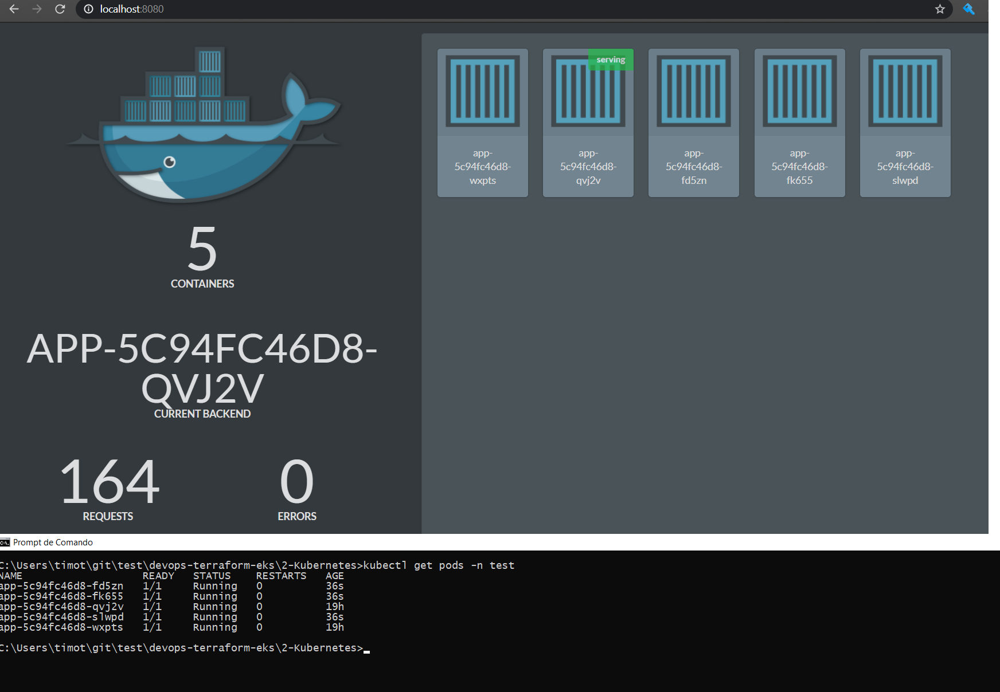

# Kubernetes Assessment

This module aims to assess the candidate in Kubernetes knowledge by asking a number of questions. It is recommended to use Docker Desktop with Kubernetes enabled as it will aid you in showing your working

## Scenario

You have been asked to quickly demonstate a few key areas of Kubernetes to a colleague as they are eager to learn and see some of the fundamentals in action.  

## Question 1

Create a deployment file called app using the image sirfragalot/docker-demo:dcus. The deployment must have two replicas.
Please name the file DeploymentTest.yaml.

**Response**: 

Done in the folder "2-Kubernetes", steps:

1-) Via Kubectl command:

*kubectl create deployment app --image=sirfragalot/docker-demo:dcus --dry-run=client -o=yaml > DeploymentTest.yaml* 

2-)  Adjusted replicas attribute to 2.

## Question 2

Create the deployment in a namespace called test

**Response**: 

1-) Added into DeploymentTest.yaml file the following statements

\*---*

*kind: Namespace*

*apiVersion: v1*

*metadata:*

 *name: test*

*\---*

2-)  Adjusted the Deployment kind type adding the metaspace name attributo with the value test to match the types.

## Question 3

Expose the Deployment so that app's contents can be seen on your local machine. Hint - sirfragalot/docker-demo:dcus runs on port 8080

**Response**: 

1-) Added into the DeploymentTest.yaml file the following statements

​    *ports:*

​    *\- containerPort: 8080*

Into the container metadata attribute

2-) Expose cluster IP and Port command:

*kubectl create service clusterip app --tcp=8080:8080 --dry-run=client -o=yaml >> DeploymentTest.yaml*

3-) Testing it

*kubectl apply -f DeploymentTest.yaml*

4-) Observing only the namespace test

*kubectl get pods -n test*

*kubectl logs -n test <app_name>*

*kubectl proxy --port=8080*

*kubectl port-forward svc/app 8080:8080 -n test*

*kubectl get all -n test*

## Question 4

Scale the replicas up to 5 and record the action. Show the recorded action and the new replicas being used

**Response**: 

*kubectl scale --replicas=5 -f DeploymentTest.yaml*

***Output message**: deployment.apps/app scaled*

*kubectl get pods -n test

## Question 5

Using kubectl, show only the pods IPs and health under the headers IP and HEALTH

**Response**: 

*kubectl get pods -n test --output=custom-columns="IP:status.podIP,STATUS:status.phase"*

Complete collumns:

*kubectl get pod -o wide -n test*

